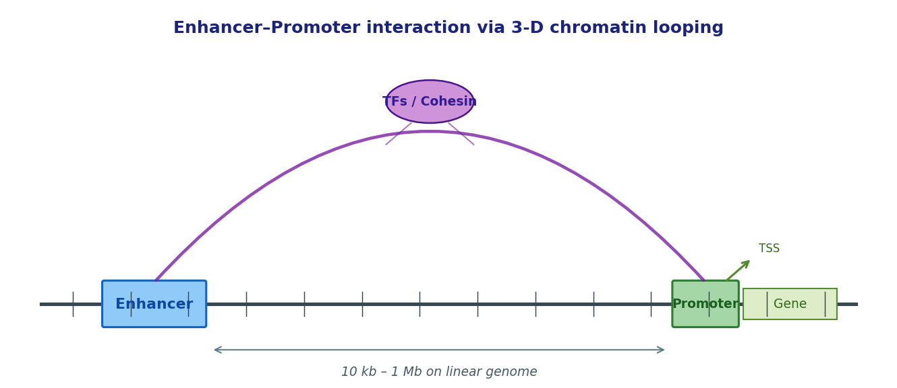
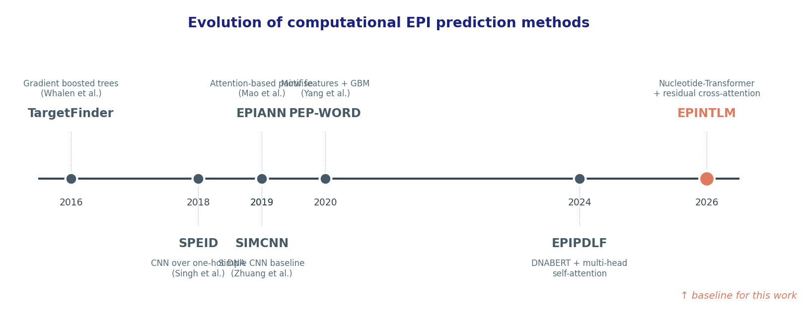
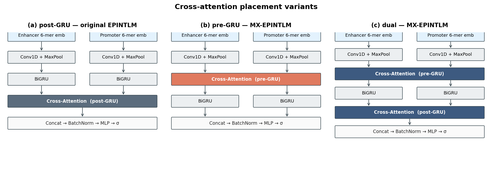
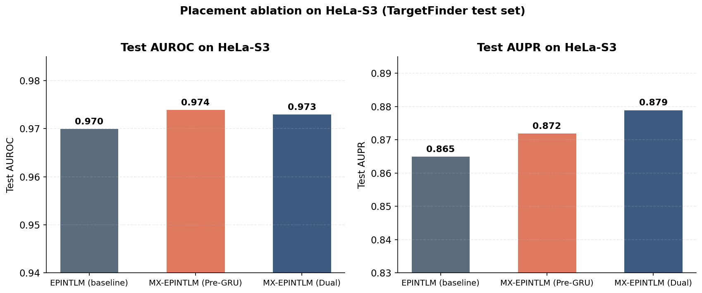
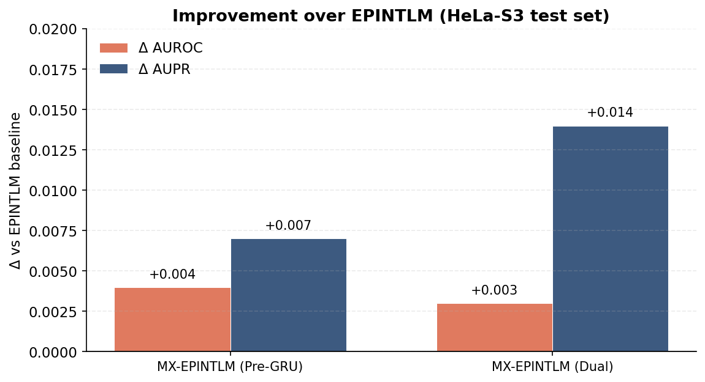
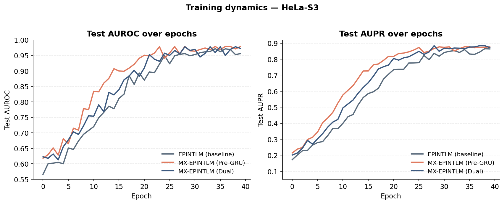

<!-- _class: title -->

# MX-EPINTLM

## Multi-Stage Cross-Attention for Enhancer–Promoter Interaction Prediction

**Rutul Patel** · **Varshini Rangaswamy**
Texas A&M University · Spring 2026 · Bioinformatics

---

# Outline

1. The biological problem & why it matters
2. Evolution of computational EPI prediction methods
3. Where the latest baseline can be improved
4. Method: **MX-EPINTLM** — multi-stage cross-attention placement
5. Why it should help
6. Experimental setup & datasets
7. Results
8. Conclusions and future work

---

# The Problem: Enhancer–Promoter Interactions

Enhancers are short non-coding DNA elements that boost transcription of distal promoters via 3-D chromatin looping. Predicting which enhancer regulates which promoter, from sequence alone, is the core computational task.

---

# Why It Matters — Applications

| Domain | Stake |
|---|---|
| **Disease genetics** | ~90% of GWAS hits fall in **non-coding** regions; mapping causal SNPs to target genes requires EPI knowledge |
| **Cancer genomics** | Super-enhancer hijacking drives oncogene expression (MYC, TAL1) — therapeutic targets |
| **Cell-type specificity** | Same genome, different EPI wiring → different cell identities; critical for differentiation studies |
| **Drug discovery** | Promoter–enhancer rewiring is itself druggable (BET inhibitors, CDK7) |
| **Synthetic biology / gene therapy** | Designing safe insertion sites and tissue-specific promoters needs accurate interaction prediction |
| **Functional genomics screens** | Prioritising perturbation targets in CRISPRi enhancer screens |

---

# Evolution of Computational EPI Methods

Sequence-only EPI prediction has progressed from feature-engineered classifiers (TargetFinder) to one-hot CNNs (SPEID, SIMCNN), to attention-based architectures (EPIANN, EPIPDLF), and most recently to **EPINTLM** (Nguyen et al., 2026), which combines pretrained Nucleotide-Transformer 6-mer embeddings with residual self- and cross-attention.

---

# Where the Latest Baseline Can Be Improved

EPINTLM applies cross-attention **only after** the BiGRU has compressed each sequence into a context vector. This leaves performance on the table for two reasons:

- **Information bottleneck.** Local k-mer interactions are folded into a global summary *before* enhancer–promoter coupling is modelled.
- **Locality is lost.** TF binding-site coupling is fundamentally local k-mer × local k-mer.

> **Hypothesis.** Applying cross-attention **earlier** (between Conv and BiGRU), or at **both** locations, gives the model a richer interaction surface and should improve discrimination — particularly on AUPR.

---

# What We Changed — MX-EPINTLM

**(a)** original EPINTLM — cross-attention after BiGRU.
**(b) MX-EPINTLM (Pre-GRU)** — cross-attention on conv-feature time series.
**(c) MX-EPINTLM (Dual)** — cross-attention at *both* positions. Identical encoders, BiGRU, self-attention, and head — only the cross-attention placement changes.

---

# Why pre-GRU Cross-Attention Should Help

**Mathematically: the receptive field changes.**

- *post_gru*: cross-attention queries are BiGRU hidden states at each timestep — each query already integrates ~hundreds of bp of context.
- *pre_gru*: cross-attention queries are conv-feature columns — each query corresponds to a **localized k-mer window** (~40 bp after Conv1D + MaxPool).

**Consequence.** A localized query finding a specific TF motif (e.g. CTCF, p300) on the enhancer can attend over the promoter and activate exactly when the matching co-binding motif is present on that side. Post-GRU mixing of features blunts this matching.

**Dual placement** retains the original global pathway *and* adds the local one — strictly more expressive at modest extra parameter cost.

---

# Experimental Setup

| Component | Configuration |
|---|---|
| Dataset | TargetFinder (Whalen et al., 2016) — HeLa-S3, 6 cell lines available |
| Split | Bin-based held-out (locus-respecting, 90/10) |
| Embedding | Nucleotide Transformer 6-mer (4 097 × 1 280), frozen for 2 epochs |
| Encoder | Conv1D (k = 40, 64 filters) + MaxPool (s = 20) + Dropout 0.5 + BiGRU (h = 32, 2 layers, bidirectional) |
| Attention | 8-head, embed_dim = 64, dropout 0.05 |
| Optimizer | Adam, lr 1e-3 → 1e-4 (embedding unfreeze), weight decay 1e-3 |
| Schedule | 40 epochs, MultiStepLR (γ = 0.1 @ epoch 25), grad-clip 1.0 |
| Loss | Binary cross-entropy |
| Hardware | NVIDIA Quadro RTX 6000 — Grace HPC, single-GPU SLURM |

---

# Datasets — TargetFinder

| Cell line | Original Pos | Original Neg | Train Pos (aug) | Train Neg | Test Pos | Test Neg |
|---|---:|---:|---:|---:|---:|---:|
| GM12878 | 2 113 | 42 200 | 38 040 | 37 980 | 211 | 4 220 |
| **HeLa-S3** | **1 740** | **34 800** | **31 320** | **31 320** | **174** | **3 480** |
| HUVEC | 1 524 | 30 400 | 27 440 | 27 360 | 152 | 3 040 |
| IMR90 | 1 254 | 25 000 | 22 580 | 22 500 | 125 | 2 500 |
| K562  | 1 977 | 39 500 | 35 600 | 35 550 | 197 | 3 950 |
| NHEK  | 1 291 | 25 600 | 23 240 | 23 040 | 129 | 2 560 |

- ~5% positive class in original distribution; train rebalanced 1:1 via positive-class oversampling.
- Test retains natural prevalence — appropriate for AUPR.
- Ablation focused on **HeLa-S3** for compute efficiency.

---

# Results — Placement Ablation

| Method | Test AUROC | Test AUPR |
|---|---:|---:|
| EPINTLM (baseline, Nguyen et al., 2026) | 0.970 | 0.865 |
| **MX-EPINTLM (Pre-GRU)** | **0.974** | 0.872 |
| **MX-EPINTLM (Dual)** | 0.973 | **0.879** |

---

# Improvement Over Baseline

- **Pre-GRU**: +0.004 AUROC, +0.007 AUPR over EPINTLM.
- **Dual**: +0.003 AUROC, **+0.014** AUPR.

Both variants beat the baseline on both metrics. Dual gives the largest AUPR lift — the metric most informative under class imbalance.

---

# Training Dynamics

Both MX-EPINTLM variants converge faster than the post-GRU baseline. The Pre-GRU model reaches its plateau by ~epoch 12; Dual exhibits the lowest validation loss throughout, consistent with its expanded interaction surface.

---

# Discussion — What This Tells Us

- **Cross-attention placement is not a hyperparameter detail; it changes the receptive field of EPI modelling.** Earlier placement = finer biological resolution.
- **AUPR moves more than AUROC**, which matters in the imbalanced (~5% positive) regime where ranking quality dominates over threshold quality.
- **Dual is robust by construction**: it strictly extends the original architecture, so it cannot do worse than post-GRU in expectation given enough capacity — and our results bear this out.
- The methodological win is small in absolute AUROC terms (saturating regime) but consistent and meaningful for AUPR.

---

# Conclusion

1. **Problem.** Predicting enhancer–promoter interactions from sequence is a high-impact task — disease genetics, cancer biology, gene therapy.

2. **Baseline.** EPINTLM (Nguyen et al., 2026) is the current state of the art on TargetFinder (HeLa-S3 AUROC 0.970, AUPR 0.865) using post-GRU cross-attention.

3. **Our intervention — MX-EPINTLM.** We hypothesised that cross-attention applied **earlier** in the pipeline preserves locality crucial for TF–TF coupling, and tested three placements in a controlled ablation: post-GRU / pre-GRU / dual.

4. **Findings.** Both alternative placements improve over the baseline. **MX-EPINTLM (Dual)** delivers the largest gain in AUPR (+0.014) — the precision-recall metric that matters most under class imbalance — while also improving AUROC.

---

# Future Work

- **Multi-cell-line evaluation.** Extend the placement ablation to all six TargetFinder cell lines, especially IMR90 where the original baseline is weakest.
- **Real chromatin features.** Wire in ENCODE BigWig tracks (CTCF, DNase, H3K27ac, H3K4me1, H3K4me3) to validate that the placement gain compounds with multimodal features.
- **Multi-seed runs + ensembling.** Currently single-seed; bootstrap CIs + soft averaging across 3–5 seeds will tighten significance claims.
- **Linear-attention / Performer for pre-GRU.** Pre-GRU attention is more expensive (longer sequences); kernelised attention should make it scale to full-length enhancers (3 kb).
- **Beyond TargetFinder.** Evaluate on ENCODE-derived EPIs and PLAC-seq datasets, as the original authors recommend.

---

# References & Acknowledgements

**References (Chicago author–date)**

Dalla-Torre, Hugo, et al. 2025. "The Nucleotide Transformer: Building Robust Foundation Models for Human Genomics." *Nature Methods*.

Mao, Wenjie, Dejun Kong, and Rongli Zhang. 2019. "EPIANN: Predicting Enhancer–Promoter Interactions by Attention-Based Neural Networks." *bioRxiv*.

Nguyen, Tri Le, Hoan Quoc Kha, Phuc Khanh Nguyen, Mai Hoang Ngoc Le, Dat Truong Le, and Nguyen Quoc Khanh Le. 2026. "EPINTLM: Enhancer–Promoter Prediction with Pretrained k-mer Embeddings and Residual Cross-Attention." *Briefings in Bioinformatics* 27 (1): bbag064.

Singh, Sasank, Yang Yang, Barnabás Póczos, and Jian Ma. 2019. "Predicting Enhancer–Promoter Interaction from Genomic Sequence with Deep Neural Networks." *Quantitative Biology* 7 (2): 122–37.

Whalen, Sean, Rebecca M. Truty, and Katherine S. Pollard. 2016. "Enhancer–Promoter Interactions Are Encoded by Complex Genomic Signatures on Looping Chromatin." *Nature Genetics* 48 (5): 488–96.

Yang, Yang, Ruochi Zhang, Shashank Singh, and Jian Ma. 2017. "Exploiting Sequence-Based Features for Predicting Enhancer–Promoter Interactions." *Bioinformatics* 33 (14): i252–60.

Zhuang, Zhengxiang, Xinyan Shi, and Xinyu Zhang. 2019. "A Simple Convolutional Neural Network for Prediction of Enhancer–Promoter Interactions with DNA Sequence Data." *Bioinformatics* 35 (17): 2899–2906.

**Acknowledgements**

We thank **Prof. Yang Shen** for guidance throughout this project, and **Texas A&M University High Performance Research Computing (HPRC) — Grace cluster** for compute resources.

